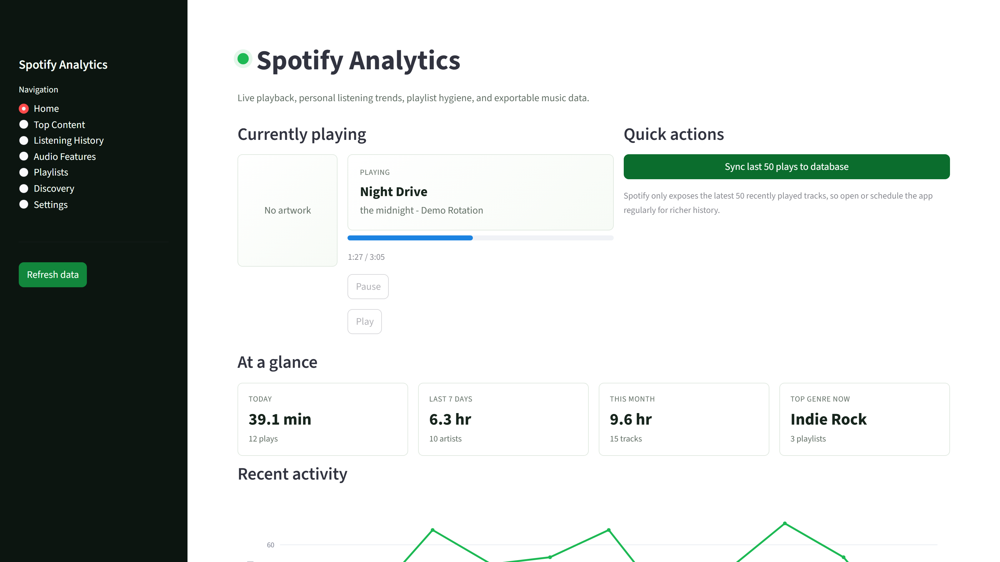

# Spotify Analytics Dashboard

Streamlit dashboard for Spotify-style listening analytics, playlist review, feature exploration, and credential-safe API workflow design. The public release includes deterministic demo mode so reviewers can inspect the app without Spotify credentials or private listening exports.

- Narrated walkthrough: [`assets/demo/narrated-demo.mp4`](assets/demo/narrated-demo.mp4)
- Validation notes: [`docs/PORTFOLIO_PROOF.md`](docs/PORTFOLIO_PROOF.md)

## Overview

Spotify projects can accidentally mix live OAuth credentials, cached tokens, private listening history, and public code. This repo separates those concerns. It keeps live API configuration local, excludes token/cache files, and ships a demo-mode path for public review.

## Problem

An analytics dashboard is not portfolio-safe if it requires private account data to understand the workflow. This project demonstrates the dashboard and API boundary without publishing credentials or personal listening data.

## What I Built

- Streamlit dashboard with listening overview, top content, history, audio feature views, and playlist workflow notes.
- OAuth-aware configuration with `.env.example` placeholders and cache/token exclusion.
- Local data-processing and visualization modules.
- Demo mode that renders deterministic sample data.
- Unit tests around data-processing behavior.
- Public-safe screenshot, WebM, GIF, and narrated MP4 demo assets.

## Evidence

| Evidence | Location |
| --- | --- |
| Demo-mode validation | [`docs/PORTFOLIO_PROOF.md`](docs/PORTFOLIO_PROOF.md) |
| Tests | [`tests/`](tests/) |
| Environment placeholder | [`.env.example`](.env.example) |
| Demo media manifest | [`assets/demo/media_manifest.json`](assets/demo/media_manifest.json) |
| Demo assets | [`assets/demo/`](assets/demo/) |

## Demo / Screenshots

All public demo media uses `SPOTIFY_DEMO_MODE=true`.



Additional captures:

- [`assets/demo/top-content.png`](assets/demo/top-content.png)
- [`assets/demo/history.png`](assets/demo/history.png)
- [`assets/demo/features.png`](assets/demo/features.png)
- [`assets/demo/workflow.png`](assets/demo/workflow.png)
- [`assets/demo/demo.webm`](assets/demo/demo.webm)
- [`assets/demo/demo.gif`](assets/demo/demo.gif)
- [`assets/demo/narrated-demo.mp4`](assets/demo/narrated-demo.mp4)

Regenerate media:

```powershell
.\.venv\Scripts\python.exe -m playwright install chromium
$env:SPOTIFY_DEMO_MODE="true"
.\.venv\Scripts\python.exe scripts\capture_spotify_media.py
```

## Tech Stack

- Python
- Streamlit
- Spotipy / Spotify Web API boundary
- Pandas
- Plotly
- SQLite/local persistence path
- pytest
- Playwright media capture

## Architecture

```text
app.py                         Streamlit dashboard
config.py                      Environment and mode configuration
spotify_client.py              Spotify API boundary
data_processor.py              Data transformation helpers
visualizations.py              Plotly chart builders
oauth_callback_capture.py      Local OAuth callback helper
tests/                         Data-processing tests
assets/demo/                   Public-safe media
docs/                          Validation notes
```

## Data Source

Live use depends on a locally authenticated Spotify developer app and the account used by the reviewer. Public demo mode uses deterministic sample data and does not redistribute private account exports.

## Environment Variables

Copy `.env.example` to `.env` locally and use your own Spotify developer credentials. Do not commit real client secrets, OAuth tokens, cache files, or personal listening exports.

## Setup

```powershell
py -3.12 -m venv .venv
.\.venv\Scripts\python.exe -m pip install -r requirements.txt
```

## How To Run

Demo mode:

```powershell
$env:SPOTIFY_DEMO_MODE="true"
.\.venv\Scripts\python.exe -m streamlit run app.py
```

Live local API mode:

```powershell
.\.venv\Scripts\python.exe -m streamlit run app.py
```

## Tests

```powershell
.\.venv\Scripts\python.exe -m pytest
```

## Security / Privacy Notes

- No Spotify client secrets are included.
- No OAuth tokens or cache files are included.
- No private listening-history exports are included.
- Demo assets are generated from deterministic sample data.
- The repo does not include AI model calls.

## Limitations

- Live behavior depends on Spotify API access and the reviewer's local credentials.
- Public demo mode is for workflow review, not a claim about a real user's listening history.
- This is not an official Spotify product.

## Roadmap

- Add richer offline export examples.
- Add CI for tests.
- Document endpoint limitations as Spotify API behavior changes.

## License

MIT License. See [`LICENSE`](LICENSE).
